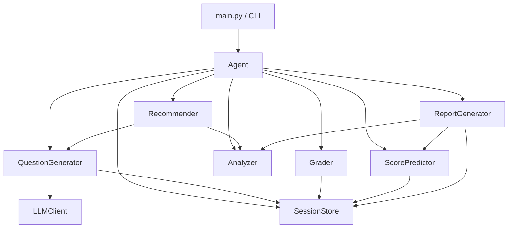
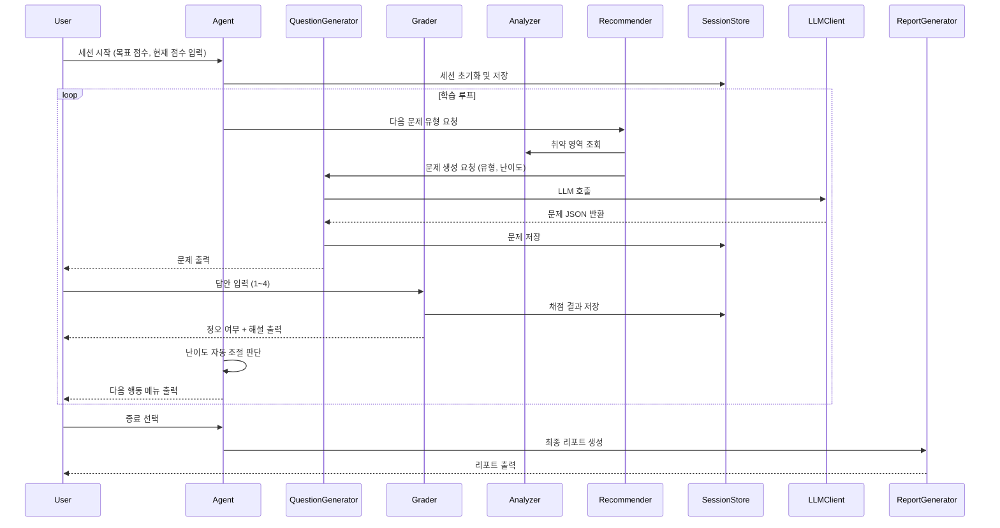

# 설계 문서: FLEX AI 학습 에이전트

## 개요

FLEX AI 학습 에이전트는 FLEX 중국어 시험 읽기(독해) 영역(600점 만점) 대비를 위한 CLI 기반 Python 애플리케이션이다. LLM(OpenAI API)을 활용하여 FLEX 스타일 4지선다 독해 문제를 자동 생성하고, 사용자의 풀이 데이터를 분석하여 예상 점수 및 맞춤형 학습 방향을 제공한다.

핵심 학습 루프는 다음과 같다:

```
세션 초기화 → 문제 생성 → 사용자 풀이 → 채점 → 오답 분석 → 맞춤 추천 → (반복)
```

주요 설계 목표:
- 컴포넌트 간 명확한 책임 분리 (단일 책임 원칙)
- LLM 호출 실패에 대한 견고한 오류 처리
- JSON 기반 로컬 영속성으로 세션 간 데이터 유지
- 테스트 가능한 순수 함수 중심 설계 (점수 계산, 난이도 판정 등)

---

## 아키텍처

### 전체 구조

```
flex_agent/
├── main.py                  # CLI 진입점, 학습 루프 조율
├── agent.py                 # Agent: 전체 흐름 조율
├── components/
│   ├── question_generator.py  # Question_Generator
│   ├── grader.py              # Grader
│   ├── analyzer.py            # Analyzer
│   ├── recommender.py         # Recommender
│   ├── score_predictor.py     # Score_Predictor
│   └── report_generator.py    # Report_Generator
├── storage/
│   └── session_store.py       # Session_Store (JSON 영속성)
├── models/
│   └── data_models.py         # 데이터 모델 (dataclass)
├── llm/
│   └── llm_client.py          # LLM API 래퍼
└── session_data.json          # 로컬 저장 파일 (런타임 생성)
```

### 컴포넌트 의존 관계



### 학습 루프 흐름



---

## 컴포넌트 및 인터페이스

### Agent (`agent.py`)

전체 학습 흐름을 조율하는 중앙 컴포넌트.

```python
class Agent:
    def run() -> None
        """메인 학습 루프 실행"""

    def initialize_session(target_score: int, current_score: int) -> Session
        """세션 초기화 및 초기 난이도 결정"""

    def adjust_difficulty() -> Optional[Difficulty]
        """최근 5문제 정답률 기반 난이도 자동 조절. 변경 시 새 난이도 반환"""

    def show_menu() -> MenuChoice
        """채점 후 다음 행동 메뉴 출력 및 선택 수신"""
```

### QuestionGenerator (`components/question_generator.py`)

LLM을 호출하여 FLEX 스타일 문제를 생성.

```python
class QuestionGenerator:
    def generate(subtype: ReadingSubtype, difficulty: Difficulty) -> Question
        """지정 유형·난이도의 4지선다 문제 생성. LLM 실패 시 QuestionGenerationError 발생"""

    def _build_prompt(subtype: ReadingSubtype, difficulty: Difficulty) -> str
        """LLM 프롬프트 구성"""

    def _parse_llm_response(raw: str) -> Question
        """LLM 응답 JSON 파싱 및 검증"""
```

### Grader (`components/grader.py`)

사용자 답안 채점 및 해설 출력.

```python
class Grader:
    def grade(question: Question, user_answer: int) -> GradeResult
        """답안 채점. 1~4 범위 외 입력 시 InvalidAnswerError 발생"""

    def display_result(result: GradeResult) -> None
        """정오 여부 및 해설 CLI 출력"""
```

### Analyzer (`components/analyzer.py`)

채점 데이터 집계 및 취약 영역 도출.

```python
class Analyzer:
    def analyze(results: List[GradeResult]) -> AnalysisResult
        """유형별 정답률 계산 및 취약 영역(정답률 < 0.6) 분류"""

    def get_weakness_subtypes(results: List[GradeResult]) -> List[ReadingSubtype]
        """취약 세부 유형 목록 반환 (정답률 오름차순 정렬)"""
```

### Recommender (`components/recommender.py`)

취약 영역 기반 다음 문제 유형 결정.

```python
class Recommender:
    def recommend_subtype(analysis: AnalysisResult, current_difficulty: Difficulty) -> ReadingSubtype
        """취약 영역 우선 순환 추천. 취약 영역 없으면 균등 추천"""

    def get_recommendation_reason(subtype: ReadingSubtype, analysis: AnalysisResult) -> str
        """추천 근거 텍스트 반환"""
```

### ScorePredictor (`components/score_predictor.py`)

정답률 기반 예상 FLEX 점수 계산.

```python
class ScorePredictor:
    def predict(results: List[GradeResult]) -> ScorePrediction
        """기본 예상 점수(정답률 × 600) 및 가중 예상 점수 계산"""

    def _weighted_score(subtype_accuracies: Dict[ReadingSubtype, float]) -> float
        """세부 유형별 가중치 적용 점수 계산"""
```

### ReportGenerator (`components/report_generator.py`)

종합 학습 리포트 생성.

```python
class ReportGenerator:
    def generate(session: Session) -> Report
        """ScorePredictor + Analyzer 결과 종합 리포트 생성"""

    def display(report: Report) -> None
        """리포트 CLI 출력"""
```

### SessionStore (`storage/session_store.py`)

JSON 파일 기반 세션 데이터 영속성.

```python
class SessionStore:
    def save(session: Session) -> None
        """임시 파일 → 교체 방식으로 안전하게 저장"""

    def load() -> Optional[Session]
        """session_data.json 로드. 파싱 실패 시 None 반환"""

    def clear() -> None
        """세션 데이터 초기화"""
```

### LLMClient (`llm/llm_client.py`)

OpenAI API 호출 래퍼.

```python
class LLMClient:
    def complete(prompt: str, model: str = "gpt-4o-mini") -> str
        """LLM 텍스트 완성 요청. API 오류 시 LLMError 발생"""
```

---

## 데이터 모델

```python
from dataclasses import dataclass, field
from enum import Enum
from typing import List, Dict, Optional
from datetime import datetime

# --- 열거형 ---

class Difficulty(Enum):
    EASY = "Easy"    # 0 ~ 350점
    MEDIUM = "Medium"  # 351 ~ 450점
    HARD = "Hard"    # 451 ~ 600점

class ReadingSubtype(Enum):
    TOPIC = "Topic"                    # 주제 찾기
    DETAIL = "Detail"                  # 세부 내용 파악
    TRUE_FALSE = "TrueFalse"           # 진위 판단
    LETTER = "Letter"                  # 편지글
    ADVERTISEMENT = "Advertisement"    # 광고문
    ACADEMIC = "Academic"              # 학술 지문

class MenuChoice(Enum):
    NEXT_QUESTION = "next"
    ANALYZE = "analyze"
    REPORT = "report"
    QUIT = "quit"

# --- 핵심 데이터 모델 ---

@dataclass
class Question:
    id: str                        # UUID
    subtype: ReadingSubtype
    difficulty: Difficulty
    passage: str                   # 중국어 지문
    question_text: str             # 질문 텍스트
    choices: List[str]             # 4개 선택지 (인덱스 0~3 → 번호 1~4)
    correct_answer: int            # 정답 번호 (1~4)
    explanation: str               # 해설
    created_at: datetime = field(default_factory=datetime.now)

@dataclass
class GradeResult:
    question_id: str
    subtype: ReadingSubtype
    difficulty: Difficulty
    user_answer: int
    correct_answer: int
    is_correct: bool
    graded_at: datetime = field(default_factory=datetime.now)

@dataclass
class AnalysisResult:
    subtype_accuracies: Dict[ReadingSubtype, float]   # 세부 유형별 정답률
    weak_subtypes: List[ReadingSubtype]               # 취약 유형 (정답률 < 0.6)
    total_accuracy: float                             # 전체 정답률

@dataclass
class ScorePrediction:
    basic_score: float             # 정답률 × 600
    weighted_score: float          # 가중치 적용 점수
    data_count: int                # 계산에 사용된 데이터 수
    is_reliable: bool              # 데이터 10개 이상 여부

@dataclass
class Report:
    predicted_score: float
    target_score: int
    achievement_rate: float        # 예상 점수 / 목표 점수 × 100
    subtype_accuracies: Dict[ReadingSubtype, float]
    strong_subtypes: List[ReadingSubtype]   # 정답률 ≥ 0.7
    weak_subtypes: List[ReadingSubtype]     # 정답률 < 0.6
    study_directions: List[str]            # 학습 방향 텍스트
    generated_at: datetime = field(default_factory=datetime.now)

@dataclass
class Session:
    target_score: int
    current_difficulty: Difficulty
    questions: List[Question] = field(default_factory=list)
    grade_results: List[GradeResult] = field(default_factory=list)
    predicted_score: Optional[float] = None
    reports: List[Report] = field(default_factory=list)
    created_at: datetime = field(default_factory=datetime.now)
    updated_at: datetime = field(default_factory=datetime.now)
```

### 난이도 ↔ 점수 범위 매핑

| 난이도 | 예상 점수 범위 |
|--------|--------------|
| Easy   | 0 ~ 350점    |
| Medium | 351 ~ 450점  |
| Hard   | 451 ~ 600점  |

### 세부 유형별 가중치 (기본값: 균등 배분)

| 세부 유형 | 가중치 |
|----------|--------|
| Topic    | 1/6    |
| Detail   | 1/6    |
| TrueFalse| 1/6    |
| Letter   | 1/6    |
| Advertisement | 1/6 |
| Academic | 1/6    |

### LLM 문제 생성 응답 JSON 스키마

```json
{
  "passage": "중국어 지문 텍스트",
  "question": "질문 텍스트",
  "choices": ["선택지1", "선택지2", "선택지3", "선택지4"],
  "correct_answer": 2,
  "explanation": "해설 텍스트"
}
```


---

## 정확성 속성 (Correctness Properties)

*속성(Property)이란 시스템의 모든 유효한 실행에서 참이어야 하는 특성 또는 동작이다. 즉, 시스템이 무엇을 해야 하는지에 대한 형식적 명세다. 속성은 사람이 읽을 수 있는 명세와 기계가 검증할 수 있는 정확성 보장 사이의 다리 역할을 한다.*

### 속성 1: 점수 범위 → 난이도 매핑

*임의의* 0~600 범위의 현재 예상 점수에 대해, 초기 난이도 결정 함수는 항상 올바른 난이도를 반환해야 한다 (0~350→Easy, 351~450→Medium, 451~600→Hard).

**검증 대상: 요구사항 1.2**

### 속성 2: 유효하지 않은 점수 입력 거부

*임의의* 0~600 범위를 벗어난 정수(음수 또는 601 이상)에 대해, 점수 유효성 검사 함수는 항상 오류를 발생시켜야 한다.

**검증 대상: 요구사항 1.3**

### 속성 3: 세션 직렬화 라운드트립

*임의의* 유효한 Session 객체에 대해, JSON으로 직렬화한 후 역직렬화하면 원본과 동등한 Session 객체가 복원되어야 한다.

**검증 대상: 요구사항 1.5, 2.5, 3.4, 9.1, 9.2**

### 속성 4: 생성된 문제의 구조적 완전성

*임의의* ReadingSubtype과 Difficulty 조합에 대해, 생성된 Question 객체는 반드시 비어있지 않은 passage, question_text, 정확히 4개의 choices, 1~4 범위의 correct_answer, 비어있지 않은 explanation을 포함해야 한다.

**검증 대상: 요구사항 2.2**

### 속성 5: 채점 정확성

*임의의* Question과 사용자 답안(1~4)에 대해, 채점 결과의 is_correct는 (user_answer == correct_answer)와 동일해야 한다.

**검증 대상: 요구사항 3.1**

### 속성 6: 유효하지 않은 답안 입력 거부

*임의의* 1~4 범위를 벗어난 정수(0, 5, 음수 등)에 대해, Grader는 항상 InvalidAnswerError를 발생시켜야 한다.

**검증 대상: 요구사항 3.3**

### 속성 7: 유형별 정답률 계산 정확성

*임의의* GradeResult 목록에 대해, 각 ReadingSubtype의 계산된 정답률은 (해당 유형의 정답 수 / 해당 유형의 전체 문제 수)와 정확히 일치해야 한다.

**검증 대상: 요구사항 4.1, 4.2**

### 속성 8: 취약 영역 분류 정확성

*임의의* 유형별 정답률 데이터에 대해, 정답률이 0.6 미만인 유형만 취약 영역으로 분류되고, 0.6 이상인 유형은 취약 영역에 포함되지 않아야 한다.

**검증 대상: 요구사항 4.3**

### 속성 9: 취약 영역 우선 추천

*임의의* AnalysisResult에 취약 영역이 존재할 때, Recommender가 반환하는 ReadingSubtype은 반드시 취약 영역 목록에 포함된 유형이어야 한다.

**검증 대상: 요구사항 5.1**

### 속성 10: 취약 영역 순환 추천

*임의의* 2개 이상의 취약 영역이 있는 AnalysisResult에 대해, N번 연속 추천 결과는 모든 취약 영역을 균등하게 순환해야 한다 (어떤 유형도 다른 유형보다 2회 이상 더 많이 추천되지 않아야 한다).

**검증 대상: 요구사항 5.2**

### 속성 11: 난이도 자동 조절 방향성

*임의의* 5개 이상의 GradeResult 목록에 대해, 최근 5문제 정답률이 0.8 이상이면 난이도가 상향되거나 이미 Hard이어야 하고, 0.4 미만이면 난이도가 하향되거나 이미 Easy이어야 한다. 0.4~0.8 사이이면 난이도가 변경되지 않아야 한다.

**검증 대상: 요구사항 6.1, 6.2, 6.3, 6.4, 6.5**

### 속성 12: 기본 예상 점수 계산

*임의의* GradeResult 목록에 대해, 기본 예상 점수는 (전체 정답 수 / 전체 문제 수) × 600과 정확히 일치해야 하며, 결과는 항상 0~600 범위 내에 있어야 한다.

**검증 대상: 요구사항 7.1**

### 속성 13: 가중 예상 점수 계산

*임의의* 세부 유형별 정답률 딕셔너리에 대해, 가중 예상 점수는 각 유형의 (정답률 × 가중치 × 600)의 합과 일치해야 하며, 결과는 항상 0~600 범위 내에 있어야 한다.

**검증 대상: 요구사항 7.2**

### 속성 14: 리포트 내용 정확성

*임의의* 유효한 Session 데이터에 대해, 생성된 Report는 (1) achievement_rate = (predicted_score / target_score × 100), (2) strong_subtypes는 정답률 ≥ 0.7인 유형만 포함, (3) weak_subtypes는 정답률 < 0.6인 유형만 포함, (4) 취약 영역이 있을 때 study_directions가 비어있지 않아야 한다는 조건을 모두 만족해야 한다.

**검증 대상: 요구사항 8.2, 8.3, 8.4**

---

## 오류 처리

### 오류 유형 및 처리 전략

| 오류 상황 | 오류 클래스 | 처리 방식 |
|----------|------------|---------|
| LLM API 호출 실패 | `QuestionGenerationError` | 오류 메시지 출력 후 재시도 여부 사용자에게 질의 |
| 유효하지 않은 점수 입력 | `InvalidScoreError` | 오류 메시지 출력 후 재입력 요청 (루프) |
| 유효하지 않은 답안 입력 | `InvalidAnswerError` | 오류 메시지 출력 후 재입력 요청 (루프) |
| JSON 파싱 실패 | `SessionLoadError` | 오류 로깅 후 빈 Session으로 초기화 |
| LLM 응답 파싱 실패 | `LLMResponseParseError` | 재시도 최대 3회, 이후 사용자에게 알림 |
| 분석 데이터 부족 (< 5개) | 경고 메시지 | 분석 불가 안내 후 계속 진행 |
| 예상 점수 데이터 부족 (< 10개) | 경고 메시지 | 신뢰도 낮음 경고와 함께 점수 출력 |

### 오류 클래스 계층

```python
class FlexAgentError(Exception): ...
class InvalidScoreError(FlexAgentError): ...
class InvalidAnswerError(FlexAgentError): ...
class QuestionGenerationError(FlexAgentError): ...
class LLMResponseParseError(QuestionGenerationError): ...
class SessionLoadError(FlexAgentError): ...
```

### LLM 호출 재시도 전략

- 최대 재시도 횟수: 3회
- 재시도 간격: 지수 백오프 (1초, 2초, 4초)
- 3회 모두 실패 시 `QuestionGenerationError` 발생 및 사용자에게 알림

### 안전한 파일 저장

```
1. session_data.json.tmp 에 새 데이터 기록
2. 기록 성공 시 session_data.json.tmp → session_data.json 으로 원자적 교체
3. 기록 실패 시 .tmp 파일 삭제, 기존 session_data.json 유지
```

---

## 테스트 전략

### 이중 테스트 접근법

단위 테스트와 속성 기반 테스트를 함께 사용하여 포괄적인 검증을 수행한다.

- **단위 테스트**: 특정 예시, 경계 조건, 오류 상황 검증
- **속성 기반 테스트**: 임의 입력에 대한 보편적 속성 검증

### 속성 기반 테스트 라이브러리

Python의 **[Hypothesis](https://hypothesis.readthedocs.io/)** 라이브러리를 사용한다.

```bash
pip install hypothesis
```

### 속성 기반 테스트 설정

- 각 속성 테스트는 최소 **100회 이상** 반복 실행
- Hypothesis 기본 설정(`@settings(max_examples=100)`) 적용
- 각 테스트에 설계 문서 속성 참조 태그 포함

태그 형식: `# Feature: flex-ai-learning-agent, Property {번호}: {속성 텍스트}`

### 속성 기반 테스트 예시

```python
from hypothesis import given, settings, strategies as st
from models.data_models import Difficulty

# Feature: flex-ai-learning-agent, Property 1: 점수 범위 → 난이도 매핑
@given(score=st.integers(min_value=0, max_value=600))
@settings(max_examples=100)
def test_score_to_difficulty_mapping(score):
    difficulty = determine_difficulty(score)
    if score <= 350:
        assert difficulty == Difficulty.EASY
    elif score <= 450:
        assert difficulty == Difficulty.MEDIUM
    else:
        assert difficulty == Difficulty.HARD

# Feature: flex-ai-learning-agent, Property 3: 세션 직렬화 라운드트립
@given(session=st_session())
@settings(max_examples=100)
def test_session_serialization_roundtrip(session):
    serialized = session_store.serialize(session)
    restored = session_store.deserialize(serialized)
    assert session == restored

# Feature: flex-ai-learning-agent, Property 12: 기본 예상 점수 계산
@given(results=st.lists(st_grade_result(), min_size=1))
@settings(max_examples=100)
def test_basic_score_prediction(results):
    prediction = score_predictor.predict(results)
    expected = (sum(r.is_correct for r in results) / len(results)) * 600
    assert abs(prediction.basic_score - expected) < 0.001
    assert 0 <= prediction.basic_score <= 600
```

### 단위 테스트 대상 (특정 예시 및 경계 조건)

| 테스트 케이스 | 검증 대상 요구사항 |
|-------------|-----------------|
| LLM 호출 실패 시 QuestionGenerationError 발생 | 2.4 |
| 채점 데이터 5개 미만 시 분석 경고 반환 | 4.5 |
| 취약 영역 없을 때 상위 난이도 균등 추천 | 5.3 |
| Hard 난이도에서 상향 조절 시도 시 변경 없음 | 6.4 |
| Easy 난이도에서 하향 조절 시도 시 변경 없음 | 6.5 |
| 데이터 10개 미만 시 신뢰도 경고 포함 | 7.4 |
| 채점 데이터 없을 때 리포트 생성 시 안내 메시지 | 8.6 |
| 손상된 JSON 파일 로드 시 빈 세션 반환 | 9.3 |

### 테스트 파일 구조

```
tests/
├── test_score_predictor.py      # 속성 1, 12, 13
├── test_session_store.py        # 속성 3, 단위: 9.3
├── test_question_generator.py   # 속성 4, 단위: 2.4
├── test_grader.py               # 속성 5, 6
├── test_analyzer.py             # 속성 7, 8, 단위: 4.5
├── test_recommender.py          # 속성 9, 10, 단위: 5.3
├── test_difficulty_adjuster.py  # 속성 11, 단위: 6.4, 6.5
└── test_report_generator.py     # 속성 14, 단위: 8.6
```
